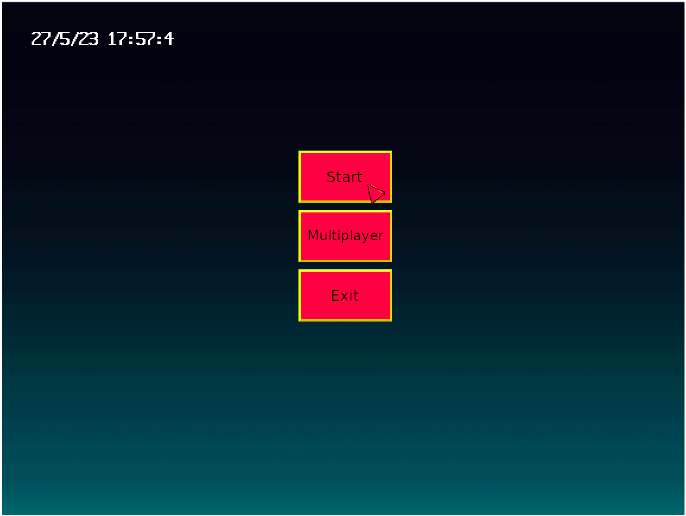
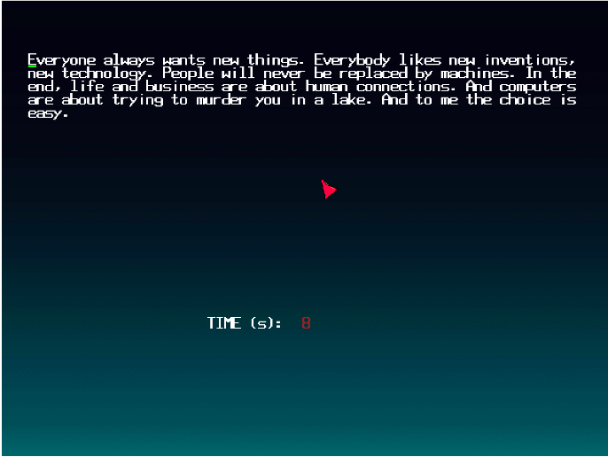
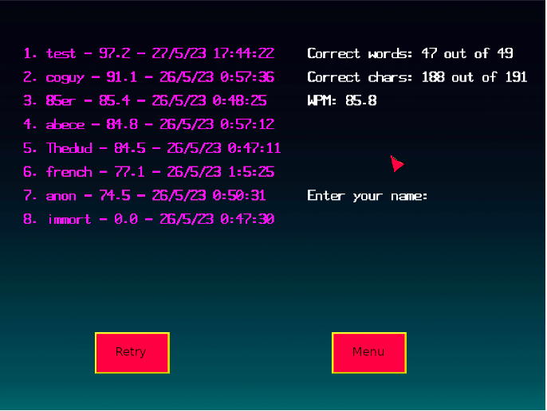

# LCOM PROJECT - TYPE RUNNER

## See `doc/lcom_proj.pdf` for the full report on how everything was implemented. 

## Video of the game
https://github.com/lulvz/LCOM/assets/39245636/231f629e-e391-45c7-a3e6-8a84de64361a

## Game menu

## Gameplay

## Gameover

## PC components used:

1. The timer was used to maintain a constant frame-rate in the
game (60hz), to update the game event and clear the bubble in
multiplayer mode. We used interrupts.

2. The graphics card was used to draw sprites (buttons,
backgrounds, animated bubble and cursor) and to draw fonts
(alphabet.c). We did not use interrupts.

3. The keyboard was used to read inputs from the user in
single/multi mode such as the key being typed or modifier keys for
special characters. There is also a quick restart functionality
implemented that lets the user press [Tab] and quickly load
another race for quick practice. We used interrupts.

4. The mouse was used to navigate the menus and in multiplayer
mode for the second player to control the place where the bubble
will be drawn. We used interrupts.

5. The RTC was used to display the date/time in the main menu for
quick access to the time without leaving the game, and in the high
score functionality of the game to save the time in which the
current score was achieved by a certain player. This is used to
keep track of progress. We did not use interrupts since we only
needed to get the date/time in certain moments of the game.

### Abstractions

Multiple abstractions were made to interface with the PC components like with the graphics card and keyboard. The code explanations for each of these is in the report.
